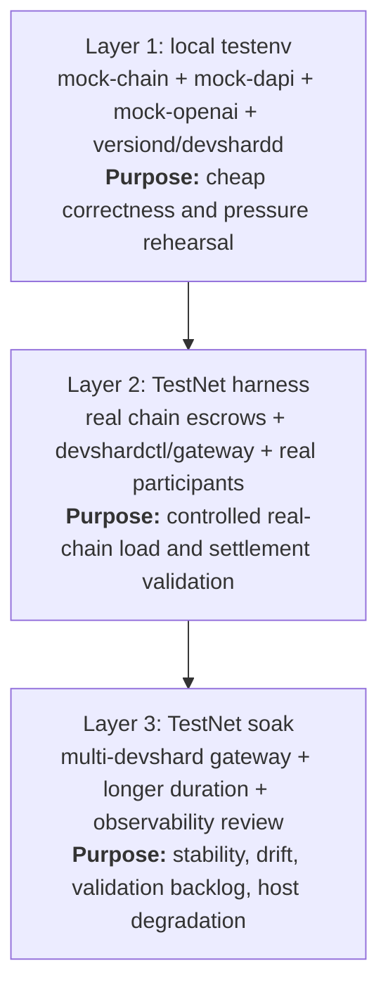

> 🔄 **Auto-sync:** from [Discussion #1685](https://github.com/gonka-ai/gonka/discussions/1685) every hour. 

# Devshard Load Testing

**Автор:** [@aikuznetsov](https://github.com/aikuznetsov) · **Категория:** :bookmark_tabs: Governance Proposal Reports · **Создано:** 2026-08-31 15:13 UTC · **Обновлено:** 2026-08-31 15:23 UTC

---

## 📝 Описание

**Scope:** define a repeatable path for load testing Devshards locally and on
TestNet, using the existing testenv, TestNet harness, gateway, escrow tooling,
and observability surfaces.

This is intentionally a proposal, not a full runbook. The detailed command
reference should live near the tools it documents.

## TL;DR

Add a concurrent load mode to
[`test-net-cloud/devshard-testing`](https://github.com/gonka-ai/gonka/tree/main/test-net-cloud/devshard-testing).
Use it in three layers:

1. Local testenv for cheap correctness and pressure rehearsal.
2. TestNet harness for controlled real-chain load and settlement validation.
3. TestNet soak for longer stability, backlog, and degradation checks.

The first useful version should answer:

- how many concurrent chat requests a gateway can sustain for a model;
- how throughput scales with the number of active devshard escrows;
- where failures appear under pressure;
- whether load creates nonce stalls, validation duplicates, orphaned receipts,
  settlement failures, or long-lived backlog;
- whether the same profile can be rehearsed locally before TestNet.

## Why This Needs Structure

The current pieces already exist, but they serve different purposes:

- local testenv proves correctness against mocks;
- TestNet harness proves escrow creation, inference, finalization, and
  settlement against a real chain;
- gateway deployment supports multiple devshards through `DEVSHARDS_JSON`;
- Prometheus/Grafana expose runtime symptoms, but not a compact run result.

The missing piece is not another one-off script. It is a reusable runner that
can apply the same request profiles across local and TestNet environments and
write comparable summary artifacts.

## Existing Building Blocks

| Area | Existing path | Useful today | Gap |
| --- | --- | --- | --- |
| Local stack | [`devshard/testenv`](https://github.com/gonka-ai/gonka/tree/main/devshard/testenv) | mock chain, mock dapi, mock OpenAI, versiond/devshardd, Postgres, optional observability | no general concurrent load mode |
| Lease-race smoke | [`devshard/testenv/scripts/lease-race-load.sh`](https://github.com/gonka-ai/gonka/blob/main/devshard/testenv/scripts/lease-race-load.sh) | sends streaming and non-streaming requests | sequential, no RPS/duration control |
| Lease monitor | [`devshard/testenv/scripts/lease-race-monitor.sh`](https://github.com/gonka-ai/gonka/blob/main/devshard/testenv/scripts/lease-race-monitor.sh) | checks duplicate validation leases | should become a reusable assertion |
| TestNet harness | [`test-net-cloud/devshard-testing`](https://github.com/gonka-ai/gonka/tree/main/test-net-cloud/devshard-testing) | creates escrows, starts devshardctl, sends requests, finalizes | smoke-oriented, request-by-request |
| Gateway config | [`deploy/join/config.devshard.env.template`](https://github.com/gonka-ai/gonka/blob/main/deploy/join/config.devshard.env.template) | supports multi-devshard gateway via `DEVSHARDS_JSON` | needs load-oriented examples |
| Observability | [`docs/observability/observability-overview.md`](https://github.com/gonka-ai/gonka/blob/main/docs/observability/observability-overview.md) | metrics and dashboards exist | runner should emit JSON/CSV summary |

## Proposed Test Layers



| Layer | Environment | What it should catch |
| --- | --- | --- |
| 1 | Local `devshard/testenv` | scheduler bugs, streaming handling, duplicate validation leases, obvious storage issues |
| 2 | TestNet harness | chain params, escrow creation, real participant behavior, settlement/finalization failures |
| 3 | TestNet soak | slow leaks, validation backlog, drift, degraded hosts, gateway stability |

## Proposed Runner

Extend the existing harness instead of adding a second load tool:

```bash
./devshard-testing --mode load ...
```

Keep the current sequential behavior as the default smoke mode.

Minimum new controls:

| Flag | Purpose |
| --- | --- |
| `--mode smoke|load` | preserve current behavior and add concurrent load |
| `--gateway-url` | target an already-running gateway instead of spawning one proxy per escrow |
| `--concurrency` | cap in-flight requests |
| `--rps` | optional global rate limit |
| `--duration` | run by wall-clock duration |
| `--requests` | run by total request count |
| `--stream-ratio` | mix streaming and non-streaming requests |
| `--prompt-profile short|long|mixed` | generate repeatable request shapes |
| `--prompt-tokens` | target prompt size |
| `--max-tokens` | cap output size |
| `--summary-file` | write machine-readable run summary |
| `--latency-file` | write per-request samples |
| `--settle-at-end` | optionally finalize and settle after the run |

Scheduler behavior:

1. Create or reuse `N` escrows.
2. Start or target a gateway.
3. Generate request jobs until `--duration` or `--requests` is reached.
4. Enforce concurrency and optional RPS.
5. Record every request outcome.
6. Periodically query gateway status.
7. Stop before exhausting the chain `max_nonce` budget.
8. Optionally finalize and settle escrows.
9. Write JSON summary and CSV latency samples.

## Output Artifacts

Each run should produce enough data to compare local, TestNet, and soak runs
without digging through logs first.

`load-summary.json` should include:

- run start/end timestamps;
- git SHA, route prefix, model, prompt profile, and gateway URL;
- escrow count and nonce budget;
- total requests, successes, failures, and achieved RPS;
- p50/p90/p95/p99 latency;
- streaming and non-streaming split;
- per-devshard request distribution;
- final gateway status snapshot;
- finalization and settlement result when enabled.

`latencies.csv` should include one row per request with timestamps, latency,
model, streaming mode, HTTP status, bounded error category, selected devshard,
prompt target, and output cap.

## Standard Profiles

These profiles are starting points. Exact SLOs should be model-specific.

| Profile | Environment | Example shape | Pass criteria |
| --- | --- | --- | --- |
| Smoke | local or TestNet | `count=3`, `requests=30`, `concurrency=3`, short prompts | no unexpected 5xx, all devshards receive traffic, status remains healthy |
| Baseline | TestNet | `count=8`, `duration=15m`, `concurrency=32`, short prompts | stable p95, no nonce stalls, no duplicate validation leases, backlog drains |
| Long context | local first, then TestNet | `prompt-tokens=45000`, `concurrency=10` | admission control is predictable, memory settles after load |
| Streaming mix | local and TestNet | `stream-ratio=0.5`, mixed prompts | streams finish cleanly, cancellations do not create unbounded orphan receipts |
| Soak | TestNet | `count=16`, `duration=3h`, `concurrency=16`, `rps=4` | no sustained memory/goroutine growth, validation backlog drains, no stuck escrows |
| Degraded host | preferably local first | one slow/unreachable/503 participant | gateway capacity drops gracefully, failures are bounded and visible |

## TestNet Devshard Version Rollout

Load testing a new DevShard build on TestNet should normally be a devshard-only
rollout, not a full TestNet redeploy.

Relevant docs: [`devshard/docs/upgrade.md`](https://github.com/gonka-ai/gonka/blob/main/devshard/docs/upgrade.md),
[`devshard/docs/rolling-update.md`](https://github.com/gonka-ai/gonka/blob/main/devshard/docs/rolling-update.md),
[`proposals/versioned/README.md`](https://github.com/gonka-ai/gonka/blob/main/proposals/versioned/README.md),
and [`test-net-cloud/nebius/README.md`](https://github.com/gonka-ai/gonka/blob/main/test-net-cloud/nebius/README.md).

Rollout path:

1. Pick the route name and binary build ID.
   - New protocol route: add a new `approved_versions.name`, for example `v5`.
   - Compatible refresh: keep the same name, for example `v4`, and change only
     `binary` and `sha256`.
2. Build the artifact:

   ```bash
   make devshardd-release DEVSHARD_VERSION=v5 DEVSHARD_BINARY_VERSION=0.2.15-v5-r1
   shasum -a 256 build/devshardd-release/devshardd.zip
   ```

3. Publish `devshardd.zip` at a URL reachable by TestNet `versiond`.
4. Submit a governance proposal that preserves current params and updates only
   `devshard_escrow_params.approved_versions`.
5. Wait for DAPI `/versions` to expose the approved version.
6. Verify `versiond` downloaded, verified, and started the binary.
7. Run the smoke profile against `/devshard/<name>`.
8. Move to baseline and soak only after smoke passes.

Avoid using
[`deploy-test-net-cloud.yml`](https://github.com/gonka-ai/gonka/blob/main/.github/workflows/deploy-test-net-cloud.yml)
for this path. That workflow is a broader cloud redeploy path and is not the
right primitive for a devshard runtime update.

## Local Workflow

Local runs should be cheap and deterministic:

1. Start `devshard/testenv` with the generated compose stack and observability.
2. Build `test-net-cloud/devshard-testing`.
3. Run `--mode load` against `--gateway-url http://localhost:8081`.
4. Reuse `lease-race-monitor.sh` after the run to assert lease uniqueness.

The detailed local command reference should stay in
[`devshard/testenv/README.md`](https://github.com/gonka-ai/gonka/tree/main/devshard/testenv)
or the harness README, not in this proposal.

## TestNet Workflow

Preflight:

1. Confirm chain gRPC and REST access.
2. Check registered models.
3. Check `devshard_escrow_params`.
4. Confirm `devshard_requests_enabled=true`.
5. Confirm `max_nonce` is sufficient for the planned run.
6. Confirm the test account is funded.
7. Confirm the route prefix is approved and served.

Example shape: run `--mode load` against TestNet gRPC/REST endpoints, target
`/devshard/<name>`, use `count=8`, `duration=15m`, `concurrency=32`, and write
both JSON summary and CSV latency samples.

Post-run:

1. Save summary artifacts with date, git SHA, model, route prefix, gateway
   config, and TestNet height range.
2. Check final escrow nonces and settlement state.
3. Check validation backlog and duplicate lease assertions.
4. Inspect gateway and devshardd metrics.
5. Finalize/settle escrows when the profile requires it.

## Metrics To Watch

Start with a short metrics list in the proposal. Keep the full dashboard query
reference in a separate runbook.

| Area | Watch |
| --- | --- |
| Gateway | requests, critical failures, limit rejections, participant transport errors, devshard picker distribution, first-content latency |
| Devshardd | terminal outcomes, inflight stages, validation throughput, orphan validations, queue drops/depth, mempool size, detected storage forks |
| Chain/runtime | `devshard_requests_enabled`, `max_nonce`, `validation_rate`, gateway status, memory, pprof captures during soak |

## Acceptance Criteria

The first implementation is accepted when:

- `test-net-cloud/devshard-testing` supports `--mode load`;
- existing smoke behavior still works;
- the runner supports duration, request count, concurrency, RPS, streaming mix,
  prompt profiles, and output files;
- local testenv load works against `http://localhost:8081`;
- TestNet load can create/reuse escrows against real chain endpoints;
- the runner stops before accidentally exhausting `max_nonce`;
- JSON summary and CSV latency samples are written;
- scheduler/statistics code has focused tests;
- no mainnet secrets, production endpoints, or operator-only assumptions are
  committed.

## Documentation Split

Keep this GitHub discussion under roughly 300 lines and move detailed material
to tool-local docs:

| Document | Purpose |
| --- | --- |
| This proposal | decision, scope, layers, acceptance criteria |
| `test-net-cloud/devshard-testing/README.md` | exact CLI flags, examples, output schema |
| `devshard/testenv/README.md` | local load-test setup and lease assertions |
| `devshard/docs/testnet-devshard-rollout.md` | TestNet devshard version rollout runbook |
| `docs/observability/...` | full metrics and dashboard query reference |

## Open Questions

1. Should TestNet load always target an already-running gateway, or should the
   harness spawn a temporary one?
2. Should settlement run in every profile, or only smoke and soak?
3. What are the first model-specific SLOs for p95 latency, error rate, and
   validation drain time?
4. Should long-context prompts be generated in the runner or imported from
   existing Compressa prompt files?
5. Should degraded-host scenarios stay local until fault injection is safe on
   TestNet?

