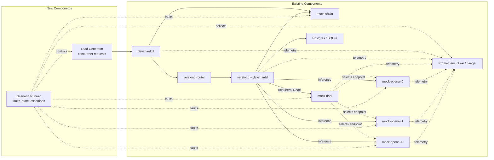

> 🔄 **Auto-sync:** from [Discussion #1685](https://github.com/gonka-ai/gonka/discussions/1685) every hour. 

# Devshard Load Testing

**Автор:** [@aikuznetsov](https://github.com/aikuznetsov) · **Категория:** :gear: Protocol Improvements · **Создано:** 2026-08-31 15:13 UTC · **Обновлено:** 2026-09-10 13:53 UTC

---

## 📝 Описание

## Goal

The goal is to validate a new Devshard version under controlled concurrent load: measure its stable capacity, verify critical request and failure paths, detect regressions, and produce reproducible, traceable evidence for any protocol or lifecycle failure. The test characterizes Devshard behavior with controlled dependencies, not real model performance or production capacity.

## Load Test Environment Architecture



### Existing Components

- **Production path:** `devshardctl`, `versiond-router`, and `versiond` running production `devshardd` binaries.
- **Controlled dependencies:** `mock-chain`, `mock-dapi`, a configurable pool of `mock-openai` nodes, and the configured Postgres or SQLite storage.
- **Observability:** the existing Prometheus, Loki, and Jaeger testenv overlay.
- **Integration harness:** `citest/harness` already starts isolated Compose projects, controls services, and reads state and telemetry.

All measured requests enter through `devshardctl /v1/chat/completions`. The mocks make chain state, ML-node allocation, timing, and failures deterministic; their own throughput is not a test result.

### New Components

- **Load Generator:** sends reproducible concurrent JSON and SSE requests, controls request cancellation, and records client outcomes and correlation identifiers. No dedicated concurrent load generator exists today.
- **Scenario Runner:** configures the selected workload and faults, coordinates the run lifecycle, waits for protocol drain, evaluates assertions, and builds failure artifacts. Existing `citest/harness` provides the foundation, but the load-oriented runner and scenario format do not exist today.

### Extensions to Existing Components

- **Mock OpenAI pool:** measured runs start at least two independent nodes, with the exact pool size configured by the scenario. Each node has its own latency, bounded worker pool and queue, failure rules, and metrics. Faults can target a node or requests selected deterministically by `X-Request-Id` and the scenario seed.
- **Mock DAPI allocator:** `AcquireMLNode` selects from the configured pool using deterministic allocation rules. It supports node availability changes and records acquisitions, releases, rejections, active allocations, and allocation distribution per node.

ML node behavior is defined by committed profiles and selected by each scenario. Timing values may be constants or ranges; ranges and error selection are resolved deterministically from `X-Request-Id` and the scenario seed.

```yaml
# ml-profiles/realistic.yaml
ttft:
  min: 150ms
  max: 350ms
token_interval: 25ms
workers: 8
queue: 32
failures:
  - request_id_hash_fraction: 0.02
    http_status: 503
```

## Load Test Scenarios

Each load-test scenario is one runnable, committed YAML file and the only unit of execution, pass/fail, artifact creation, and reproduction. It defines one workload, one fault mode, Devshard and Mock ML pool topology, ML profiles, allocation rules, request shape, seed, thresholds, and drain timeout.

| Scenario | Workload | Fault injection | Required outcome |
| --- | --- | --- | --- |
| `normal-load` | stepped concurrency with mixed JSON and SSE requests | none; the Mock ML pool remains fast and unsaturated | find the highest stable concurrency while all accepted requests reach valid terminal states |
| `client-cancel` | steady concurrent JSON and SSE traffic | deterministic cancellation after headers or first content | cancellation reaches its expected terminal state without orphaned execution |
| `ml-5xx` | steady concurrent traffic across multiple Mock ML nodes | selected node returns request-selective 5xx responses | failures are classified and correlated with the selected node while the system remains drainable |
| `slow-ml` | steady concurrent traffic across multiple Mock ML nodes | selected node uses a high-TTFT or slow-token profile | timeout and backpressure behavior is classified correctly without stuck state |
| `partial-stream` | concurrent SSE traffic | selected requests omit their terminal stream marker | the client and Devshard classify the broken stream and drain all resulting work |
| `ml-overload` | traffic above the configured capacity of one Mock ML node | bounded workers and queue on the selected node | overload is handled without orphaned execution and the system recovers after load stops |
| `validation-race` | sustained concurrency with delayed validation | deterministic validation delays and lease contention | each validation has one owner and terminal outcome, with no duplicate commits or stale leases |

Initial implementations should reuse the behavior already covered by [`devshard/testenv/citest`](https://github.com/gonka-ai/gonka/tree/main/devshard/testenv/citest), including lost-first-chunk, ML 5xx, error-finish-miss, and validation lease-race tests.

Fault selection must be reproducible. A scenario uses explicit request IDs or a stable hash of `request_id` and seed. Unseeded probability and wall-clock race timing are not sufficient for a reproducible failure.

Thresholds belong in scenario files, not in generator code.

## Test Execution

The scenario runner is the control plane. It should build on the existing Go `citest/harness` and:

1. Start an isolated Compose project and wait for readiness.
2. Apply deterministic mock and fault configuration.
3. Capture initial Devshard state.
4. Start the load-generator container.
5. Trigger configured request-scoped cancellations or service actions.
6. Stop new traffic and wait for bounded protocol drain.
7. Collect accounting, state, logs, and metrics.
8. Evaluate assertions and write result artifacts.

The load generator is the data plane. It should not mutate chain or Devshard state outside normal gateway requests. Its MVP controls are gateway URL, concurrency, duration, stream ratio, request size, timeout, cancellation phase, run ID, seed, and output path.

For every request it records a request ID, timestamps, HTTP outcome, time to headers, time to first content, total duration, stream terminal marker, and response identifiers. Open-loop RPS scheduling is deferred until the closed-loop scenarios are stable.

## Correctness Assertions

A run fails regardless of throughput when:

- an accepted request has no terminal outcome after drain;
- an injected fault produces an unexpected terminal class or reason;
- a JSON response is malformed or an SSE response has an invalid ending;
- a session reuses or regresses a nonce;
- the same validation work is owned or committed more than once;
- a receipt, execution, validation, or finish remains orphaned;
- replicas report divergent durable session state;
- queues, leases, or in-flight operations do not drain;
- a required service restarts or becomes unready unexpectedly;
- a failed request cannot be correlated with gateway accounting and relevant terminal state.

Expected injected failures count as scenario outcomes, not successful user requests. The assertion engine must distinguish them from unexpected failures.

## Measurements

The initial implementation should measure Devshard behavior, not general container infrastructure.

| Area | Required signals |
| --- | --- |
| Client outcome | achieved RPS, success/error/timeout rate, p50/p95/p99 TTFT and total latency, completed and broken streams |
| Devshard behavior | accepted and terminal requests, in-flight work, rejection reasons, validation queue depth, drain time |
| Host distribution | requests and terminal outcomes per selected host |
| ML allocation | acquisitions, releases, rejections, active allocations after drain, allocation distribution per node |
| Mock ML pool | active and queued requests per node, completions, failures, cancellations, saturation, and overloads |
| Test validity | generator-dropped jobs and unexpected mock dependency saturation |

A run is invalid when the load generator or a mock dependency unexpectedly reaches its own capacity before the intended Devshard condition. Saturation is valid only when explicitly required by the selected scenario.

For `normal-load`, the result is the highest concurrency step that passes all correctness assertions, remains within the scenario's latency and error thresholds, and drains within its deadline. It is a regression baseline for the same environment, not a production capacity claim.

CPU, memory, network, and Postgres metrics are optional diagnostics. They may be enabled while investigating a bottleneck but are not pass/fail signals for the initial scenarios.

## Failure Artifacts

Write one result directory per run:

```text
results/<run_id>/
  run.yaml
  summary.json
  requests.jsonl
  assertions.json
  failures/<request_id>.json
```

`summary.json` contains the build identity, scenario, seed, topology, workload steps, throughput, latency, failure counts, and final assertion result.

`requests.jsonl` contains the correlation and client outcome for every generated request. Detailed per-request samples are optional for long successful runs but mandatory for failed requests.

Each failure bundle contains the request and client outcome, gateway accounting, all correlation identifiers, relevant terminal events and bounded logs, applied fault configuration, state snapshots, failed assertion, and reproduction command.

Large raw logs may remain in the observability backend. The bundle must contain stable identifiers and queries needed to retrieve them.

